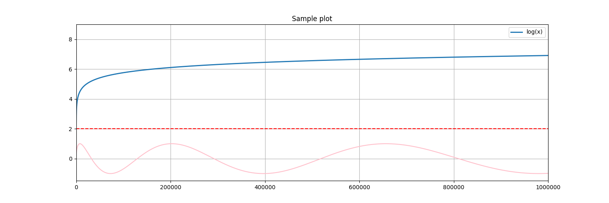
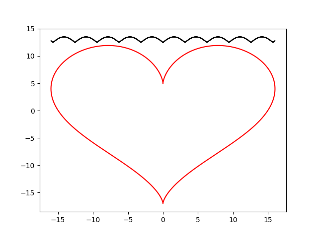
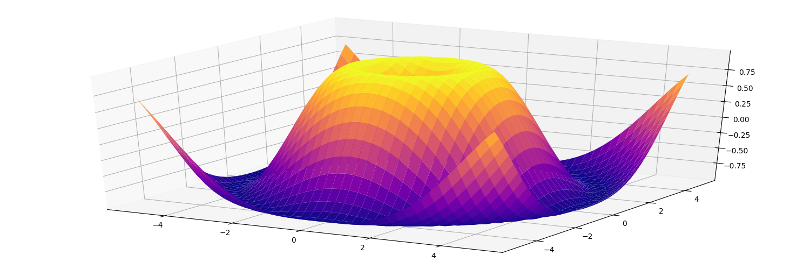
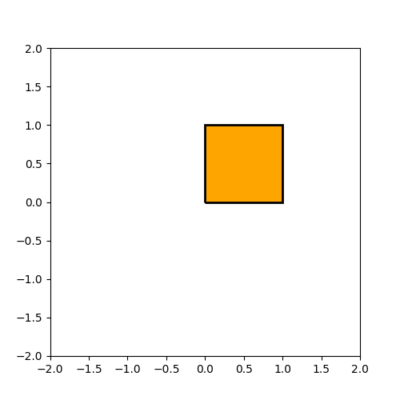
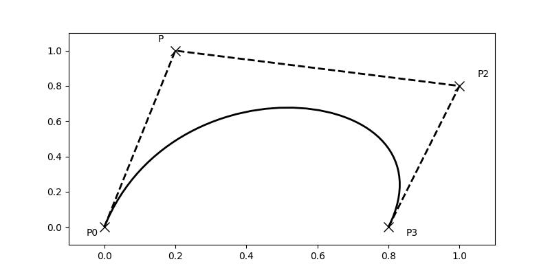
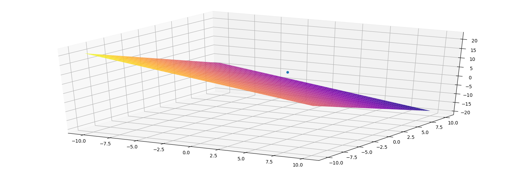

[](https://travis-ci.org/xmba15/Another_MatplotlibCpp/builds)
[](https://opensource.org/licenses/MIT)

# C++ Wrapper for Python Matplotlib Lib #
I was looking for a light-weighted C++ library for visualization to integrate into my programs when I realized that there are no officialy *small* ones existing. One attempt that I noticed was a C++ wrapper for the famous visualization python library: Matplotlib (the original one can be found [HERE](https://github.com/lava/matplotlib_cpp); and the modified program with CMake build can be found [HERE](https://github.com/xmba15/matplotlib_cpp)). However, looking at the source codes to find a way to expand the library, I found out that the current approach directly utilizing Python/C API; makes it quite difficult for an expansion. That is the start of this library, written with pybind11 in hope of providing a more convenient way to connect with Matplotlib library.

## Dependencies ##
 - OS: Ubuntu (tested on 16.04, 19.04)
 - compiler: tested with gcc-6
 - C++11 and above
 - python2/3
 - [pybind11](https://github.com/pybind/pybind11.git) : C++ library for seamless conversion between C++ and python
 - [matplotlib](https://matplotlib.org/)
 - [cmake](https://cmake.org/): >= 3.8

## How to Build ##
### Commands ###
```bash
cd /path/to/this/root/directory
mkdir build && cd build && cmake ../
make -j`nproc`
```

### Build Options ###
 - BUILD_EXAMPLES=ON/OFF (default OFF): whether to build examples or not.
 - WITH_DEBUG=ON/OFF (default OFF): whether to enable debug macro or not.
 - WITH_TEST=ON/OFF (default OFF): whether to build test or not.
 - WITH_DOC=ON/OFF (default ON): whether to build doxygen documentations or not.

## Examples ##
All the examples can be found in [examples](./examples) directory.

### Basic Operations ###
[Source Code](./examples/Basic.cpp)

<p align="center">
    
</p>

Important parts of the code:
```cpp
    // import modules of matplotlib library
    pe::vis::Matplotlib mpllib;

    // check if the modules are imported successully or not
    if (!mpllib.imported()) {
        std::cout << "Failed to import matplotlib library\n";
        exit(EXIT_FAILURE);
    }

    ...

    // create a figure of desired size
    mpllib.figure(1200, 780);

    // plot with default parameters
    mpllib.plot(x, y);

    // plot with user-input parameters
    mpllib.plot(x, w,
                {
                    {"color", pe::vis::Matplotlib::createAnyBaseMapData<std::string>("r")},
                    {"linestyle", pe::vis::Matplotlib::createAnyBaseMapData<std::string>("--")},
                });

    // plot with user-input parameters
    mpllib.plot(x, z,
                {
                    {"label", pe::vis::Matplotlib::createAnyBaseMapData<std::string>("log(x)")},
                    {"lw", pe::vis::Matplotlib::createAnyBaseMapData<int>(2)},
                });

    // limit for x axis
    mpllib.xlim(0, 1000 * 1000);

    // add grid
    mpllib.grid();

    // add title
    mpllib.title("Sample plot");

    // add legend with default location (best)
    mpllib.legend();

    // save figure
    mpllib.savefig("Basic.png");

    // show figure
    mpllib.show();
```
It can be seen here that user can input flexible parameters of "arbitary" types (currently support bool, int, float, double, std::string - but the list of supported types can be easily extended) into the function; which make it easier to modify parameters just like in python code.
To pass new parameters, you need to create a map like the following:
```cpp
{
    {"label", pe::vis::Matplotlib::createAnyBaseMapData<std::string>("log(x)")},
    {"lw", pe::vis::Matplotlib::createAnyBaseMapData<int>(2)},
}
```
Each pair has the following structure:
```
{[string of name of the python parameter] : pe::vis::Matplotlib::createAnyBaseMapData<[type of the parameter]>([value of the parameter])}
```

### Fancy Figure ###
[Source Code](./examples/Modern.cpp)

<p align="center">
    
</p>

### 3D Figure ###
[Source Code](./examples/Surface.cpp)

<p align="center">
    
</p>

### Path ###
[Source Code](./examples/Path.cpp)

<p align="center">
    
</p>

### Bezier Path ###
[Source Code](./examples/BezierPath.cpp)

<p align="center">
    
</p>

### Hyperplane ###
[Source Code](./examples/Hyperplane.cpp)

<p align="center">
    
</p>


More examples can be easily created by using current wrapped functions or adding more modules, functions from python side.
